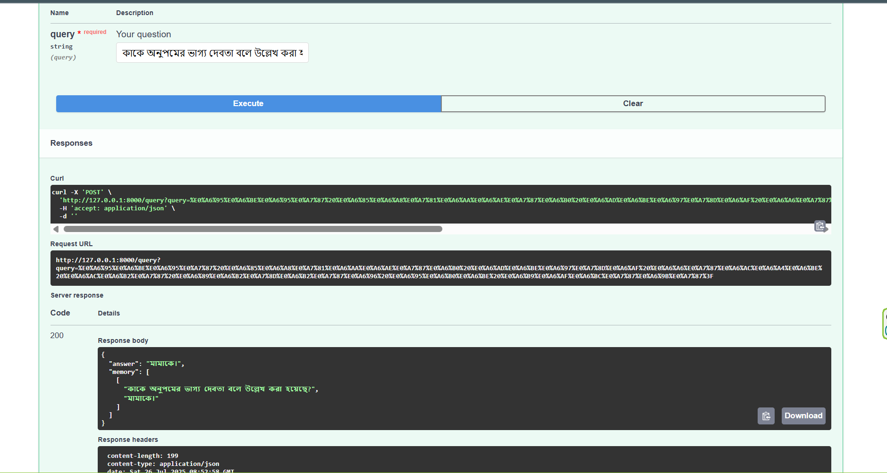

# Multilingual RAG Pipeline for Bengali/English Q&A

A Retrieval-Augmented Generation (RAG) system optimized for Bengali and English text processing, specifically designed for HSC Bangla textbook content with intelligent content type detection and multimodal support.

## 🚀 Features

- **Multilingual Support**: Bengali and English text processing
- **Intelligent Chunking**: Content-type aware chunking (MCQ, vocabulary, story content)
- **Multimodal Embeddings**: CLIP support for text+image content
- **Smart Retrieval**: Query-type detection for optimized search
- **Memory System**: Short-term conversation memory
- **REST API**: FastAPI-based web service
- **Persistent Storage**: ChromaDB vector database

## 🛠️ Setup Guide

### Prerequisites
- Python 3.8+
- Git
- CUDA (optional, for GPU acceleration)

### Installation

1. **Clone the repository**
```bash
git clone <your-repo-url>
cd rag-multilingual-pipeline
```

2. **Create virtual environment**
```bash
python -m venv venv
source venv/bin/activate  # On Windows: venv\Scripts\activate
```

3. **Install dependencies**
```bash
pip install -r requirements.txt
```

4. **Environment setup**
```bash
cp env.example .env
# Edit .env and add your GEMINI_API_KEY
```

5. **Add your PDF**
```bash
# Place your Bengali PDF in data/hsc_bangla_1st.pdf
mkdir -p data
# Copy your PDF file to data/hsc_bangla_1st.pdf
```

6. **Process PDF and create embeddings**
```bash
python process_pdf.py
```

7. **Start the server**
```bash
# Method 1: Direct FastAPI
uvicorn app.main:app --reload --host 0.0.0.0 --port 8000

# Method 2: Using start script (if available)
python start_server.py
```

## 📦 Used Tools, Libraries & Packages

### Core Dependencies
- **FastAPI**: Web framework for API development
- **ChromaDB**: Vector database for embeddings storage
- **Google Generative AI**: Gemini model for embeddings and text generation
- **PyPDF2**: PDF text extraction
- **NLTK**: Natural language processing utilities

### Optional (Enhanced Features)
- **PyTorch**: Deep learning framework for CLIP
- **CLIP**: OpenAI's multimodal embeddings
- **Pillow**: Image processing for multimodal content
- **scikit-learn**: Additional ML utilities

### Complete Package List
```txt
fastapi
uvicorn
PyPDF2
nltk
chromadb
google-generativeai
python-dotenv
torch
torchvision
git+https://github.com/openai/CLIP.git
Pillow
numpy
requests
scikit-learn
```

## 🔍 Sample Queries and Outputs

### Bengali Queries




```

**Query**: `ফল্গু শব্দের অর্থ কী?`
```json
{
  "answer": "ফল্গু শব্দের অর্থ হলো 'তুচ্ছ', 'সামান্য' বা 'নগণ্য'। এটি সংস্কৃত শব্দ যা বাংলা সাহিত্যে ব্যবহৃত হয়।",
  "memory": [
    ["ফল্গু শব্দের অর্থ কী?", "ফল্গু শব্দের অর্থ হলো 'তুচ্ছ'..."]
  ]
}
```

### English Queries

**Query**: `What is the main theme of Aparichita story?`
```json
{
  "answer": "The main theme of 'Aparichita' revolves around social prejudices, dowry system, and the clash between traditional values and progressive thinking in Bengali society.",
  "memory": [
    ["What is the main theme of Aparichita story?", "The main theme of 'Aparichita' revolves around..."]
  ]
}
```


## 📚 API Documentation

### Base URL
```
http://localhost:8000
```

### Endpoints

#### POST `/query`
Ask a question in Bengali or English.

**Request**:
```bash
curl -X POST "http://localhost:8000/query?query=অনুপমের অভিভাবক কে ছিলেন?" \
     -H "Content-Type: application/json"
```

**Response**:
```json
{
  "answer": "string",
  "memory": [["query", "answer"], ...]
}
```

**Parameters**:
- `query` (string, required): Your question in Bengali or English

**Response Model**:
```python
class QueryOutput(BaseModel):
    answer: str
    memory: List[Tuple[str, str]]
```

### Interactive API Documentation
- Swagger UI: `http://localhost:8000/docs`

## 📊 Architecture Overview

```
PDF Input → Text Extraction → Intelligent Chunking → Embedding Generation → Vector Storage
                                     ↓
Query Input → Query Embedding → Similarity Search → Context Retrieval → Answer Generation
```

## ❓ Technical Deep Dive

### 1. Text Extraction Method

**Method Used**: [`PyPDF2`](rag/loader.py) library

**Why PyPDF2**:
- Simple and reliable for text-based PDFs
- Lightweight with minimal dependencies
- Good Unicode support for Bengali text
- Easy integration with Python ecosystem

**Formatting Challenges Faced**:
- Bengali character encoding issues initially resolved by proper UTF-8 handling
- Inconsistent spacing and line breaks in extracted text
- Mixed Bengali-English content requiring language-aware processing
- Table and column structures lost during extraction

**Solution Implemented**:
```python
def load_pdf(path):
    reader = PdfReader(path)
    return "\n".join([page.extract_text() for page in reader.pages if page.extract_text()])
```

### 2. Chunking Strategy

**Strategy Used**: Content-type aware chunking with hybrid approach

**Implementation**:
- **MCQ Detection**: Preserves complete question-answer blocks
- **Vocabulary Entries**: Keeps word-meaning pairs intact  
- **Story Content**: Sentence-based chunking with 300-character limit
- **Intelligent Splitting**: Uses Bengali sentence markers (।!?)

**Why This Works Well**:
- Preserves semantic units (complete MCQs, vocabulary entries)
- Maintains context within story content
- Reduces information fragmentation
- Optimized for Bengali text structure

**Code Implementation**:
```python
def chunk_text_by_content_type(text, chunk_size=300):
    # Detects MCQ, vocabulary, and story content
    # Applies appropriate chunking strategy for each type
```

### 3. Embedding Model Choice

**Primary Model**: CLIP (ViT-B/32) with Gemini fallback

**Why CLIP**:
- **Multimodal Support**: Handles both text and images
- **Multilingual Capability**: Better cross-lingual understanding
- **Faster Processing**: Local inference without API calls
- **Normalized Embeddings**: Better for similarity search

**Fallback**: Google Gemini text-embedding-004
- **High Quality**: State-of-the-art text understanding
- **Bengali Support**: Trained on multilingual data
- **768-dimensional**: Rich semantic representation

**Meaning Capture**:
- CLIP's contrastive training captures semantic relationships
- Cross-modal understanding helps with textbook content
- Normalized embeddings ensure consistent similarity scores

### 4. Similarity Comparison & Storage

**Similarity Method**: Cosine similarity (via ChromaDB)

**Storage Setup**: ChromaDB with persistent storage

**Why This Approach**:
- **Cosine Similarity**: Scale-invariant, works well with normalized embeddings
- **ChromaDB**: Built for vector similarity search, efficient querying
- **Metadata Filtering**: Content-type aware retrieval
- **Persistent Storage**: No need to recompute embeddings

**Implementation**:
```python
def retrieve_similar(embedding: List[float], n_results: int = 5, content_type_filter: str = None):
    # Uses ChromaDB's built-in cosine similarity
    # Supports metadata filtering for content types
```

### 5. Meaningful Query-Document Comparison

**Strategies Implemented**:

1. **Query Type Detection**:
```python
def detect_query_type(query: str) -> str:
    vocabulary_keywords = ['অর্থ', 'মানে', 'শব্দার্থ', 'টীকা']
    mcq_keywords = ['বিকল্প', 'সঠিক উত্তর', 'কোনটি']
    # Routes to appropriate content types
```

2. **Content Type Filtering**: Matches query types with relevant content
3. **Same Embedding Space**: Query and documents use identical embedding process
4. **Language Consistency**: Preserves original language in responses

**Handling Vague Queries**:
- Falls back to general search across all content types
- Returns top-k results to provide broader context
- Generator model handles ambiguity with "I don't know" responses
- Memory system provides conversation context

### 6. Result Relevance Assessment

**Current Performance**: Good for specific queries, room for improvement on complex questions

**What Works Well**:
- Vocabulary lookups: High accuracy
- Specific character/plot questions: Good results
- MCQ identification: Reliable content type detection

**Areas for Improvement**:

1. **Better Chunking**:
   - Cross-paragraph context preservation
   - Sliding window approach for longer contexts

2. **Enhanced Embedding**:
   - Fine-tuned models on Bengali literature
   - Domain-specific embedding training

3. **Larger Document Corpus**:
   - Multiple textbooks for broader coverage
   - Related literary works for context

4. **Advanced Retrieval**:
   - Hybrid search (semantic + keyword)
   - Query expansion for Bengali synonyms
   - Re-ranking based on content type relevance

**Potential Enhancements**:
```python
# Future improvements could include:
- Hierarchical chunking with section awareness
- Query expansion using Bengali thesaurus
- Ensemble embedding methods
- Dynamic chunk size based on content type
```

## 🔧 Configuration

### Environment Variables (.env)
```env
GEMINI_API_KEY=your_gemini_api_key_here
HOST=127.0.0.1
PORT=8000
LOG_LEVEL=INFO
```

### Key Configuration Files
- [`app/config.py`](app/config.py): Main configuration
- [`requirements.txt`](requirements.txt): Dependencies
- [`.env`](.env): Environment variables

##  Usage Examples

### Programmatic Usage
```python
from rag.retriever import retrieve_chunks
from rag.generator import generate_answer

# Retrieve relevant chunks
chunks = retrieve_chunks("অনুপমের চরিত্র কেমন?")

# Generate answer
context = "\n".join(chunks)
answer = generate_answer("অনুপমের চরিত্র কেমন?", context)
```

### API Usage
```bash
# Bengali question
curl -X POST "http://localhost:8000/query" \
  -H "Content-Type: application/json" \
  -d '{"query": "রবীন্দ্রনাথের জন্ম কবে?"}'

# English question  
curl -X POST "http://localhost:8000/query" \
  -H "Content-Type: application/json" \
  -d '{"query": "When was Rabindranath born?"}'
```

## Contributing

1. Fork the repository
2. Create a feature branch
3. Make your changes
4. Add tests if applicable
5. Submit a pull request


## Acknowledgments

- Google Generative AI for embedding and generation capabilities
- OpenAI CLIP for multimodal embeddings
- ChromaDB for efficient vector storage
- FastAPI for the web framework
